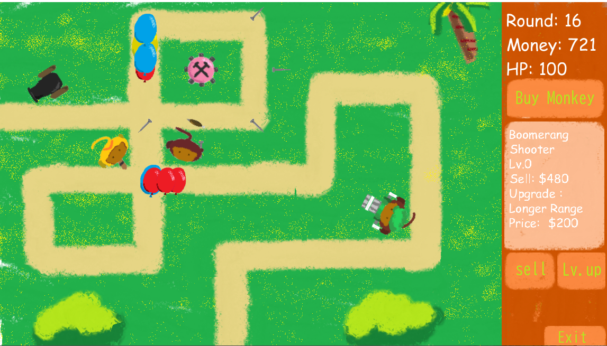

# Final-Project

> Forked from Github Classroom for National Taiwan University's Fundamental OOP course, in Spring 2021.
> Done as a team with 3 people: 黃政穎, 郭承諺, 戴培凱. Responsibility / Workload for each member is written in `report.pdf`. Although due to Github rendering issue, it is best to download the report and read on Adobe PDF reader.

BalloonTD, a remake of a series of popular flash games: Bloons Tower Defence.

## Compile & Run

LibGDX actually uses Gradle to manage project. Although there are `gradlew` and `gradlew.bat` came with LibGDX, I don't really know what OS you are running on. Thus `make run` will run a premade JAR file.

If you want to use Gradle, use `make run_gradle_linux` or `make run_gradle_windows`. Note that this will install gradle in your home directory. More information about this at https://github.com/libgdx/libgdx-gradle-template

## Source Code

Most of the source code is in `core/src/...`. Platform-dependent code is in directories like `desktop/`, `html/`, etc.

For a more detailed introduction and explanation to this project, please refer to `report.pdf`.
